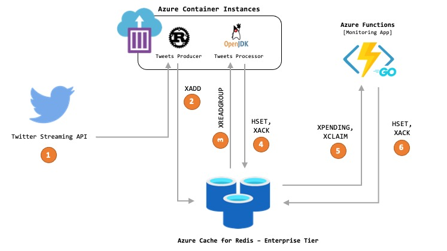

# Redis Streams in Action

A practical example to showcase [Redis Streams](https://redis.io/topics/streams-intro) in action. The goal is to process Twitter data in real-time for search and query tweets based on some criteria such as hashtags, user, location etc. [RediSearch](https://redisearch.io/) and [Redis Streams](https://redis.io/topics/streams-intro) serve as the backbone of this solution. 

It consists of several co-operating components:

1. Twitter Stream Consumer: A [Rust](https://rustlang.org/) application to consume streaming Twitter data and pass them on to Redis Streams. I will demonstrate how to run this as a Docker container in [Azure Container Instances](https://docs.microsoft.com/azure/container-instances/container-instances-overview?WT.mc_id=data-17927-abhishgu)
2. Tweets Processor: The tweets from Redis Streams are processed by a Java application - this too will be deployed (and scaled) using Azure Container Instances.
3. Monitoring service: The last part is a [Go](https://golang.org/) application to monitor the progress of the tweets processor service  and ensure that any failed records are re-processed. This is a Serverless component which will be deployed to [Azure Functions](https://docs.microsoft.com/azure/azure-functions/functions-overview?WT.mc_id=data-17927-abhishgu) where you can run it based on a [Timer trigger](https://docs.microsoft.com/azure/azure-functions/functions-bindings-timer?tabs=csharp&WT.mc_id=data-17927-abhishgu) and only pay for the duration it runs for.
